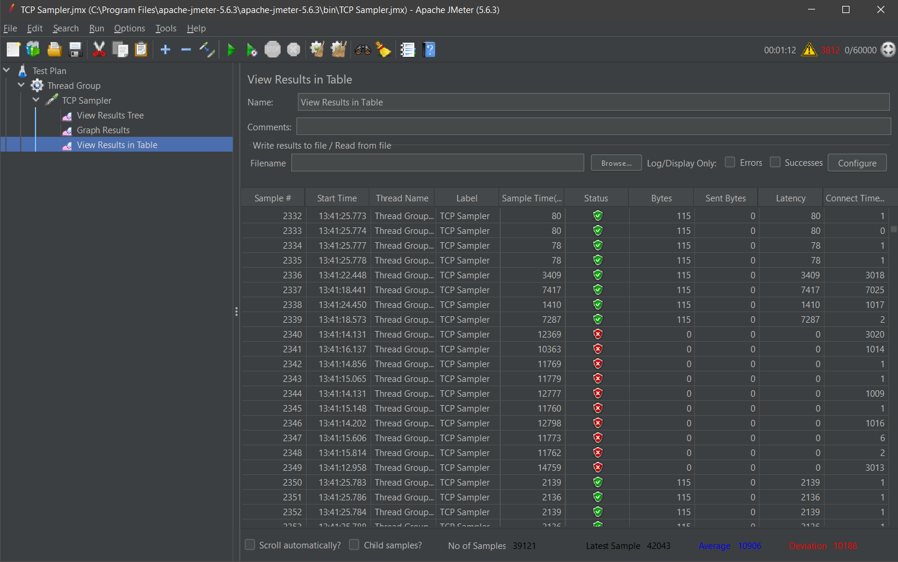
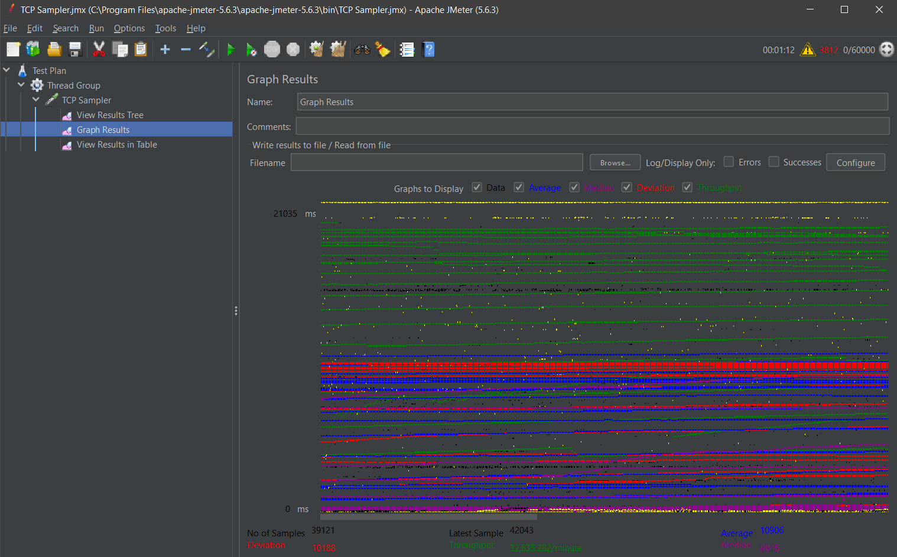
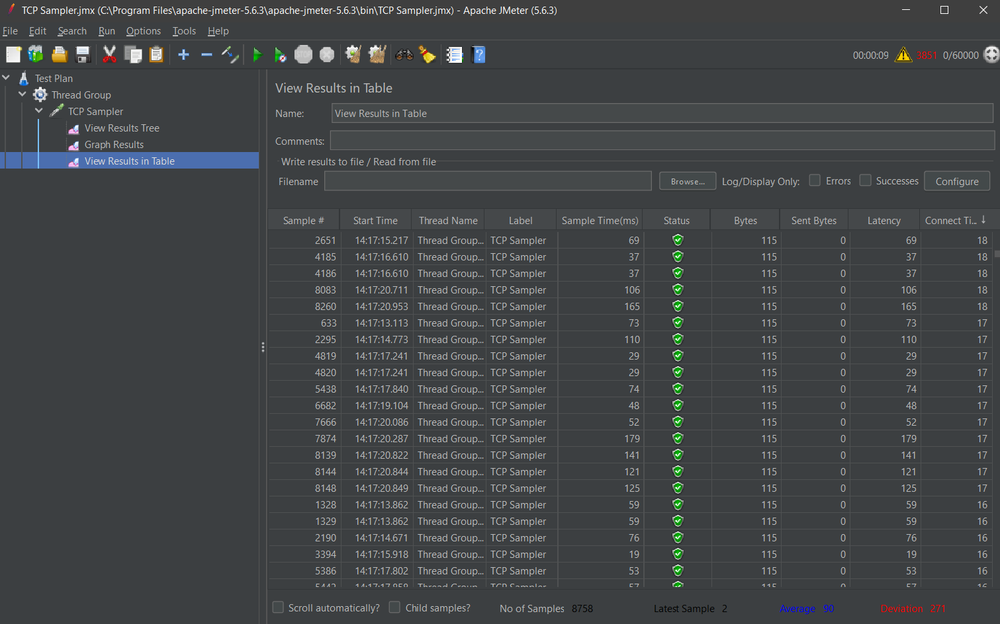
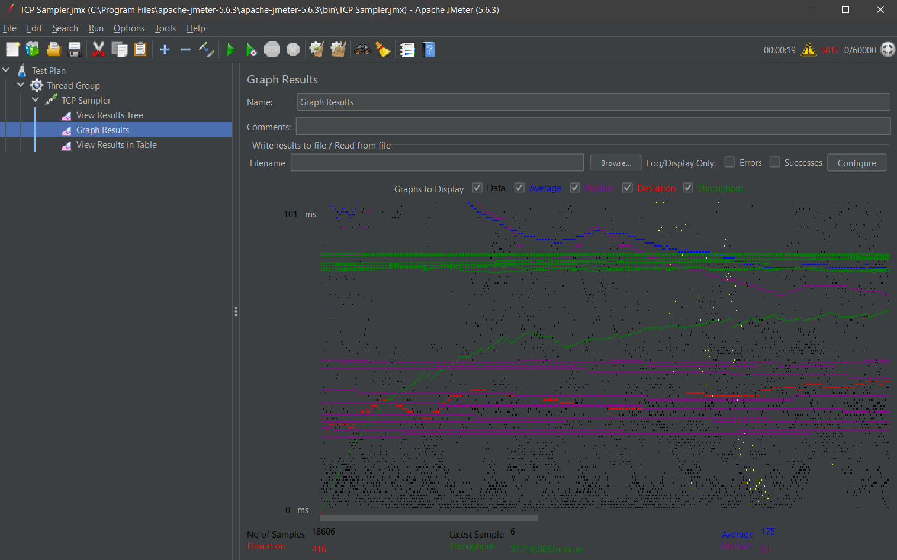
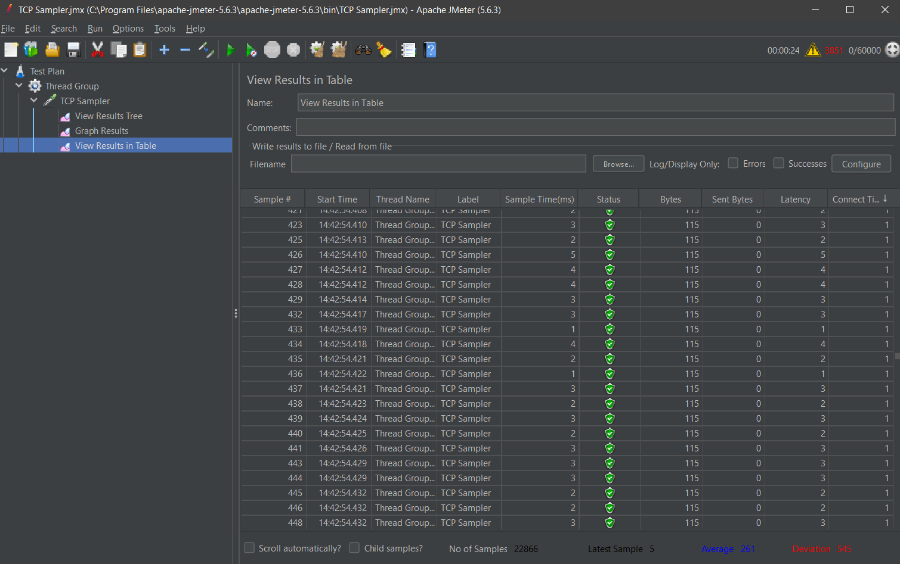
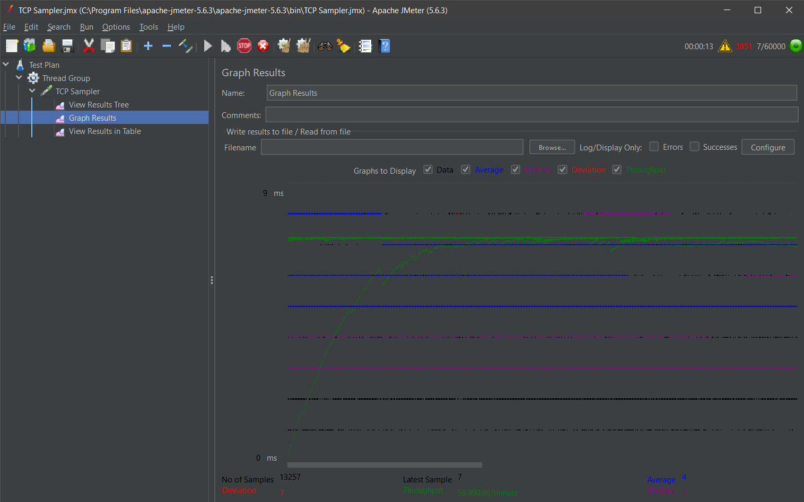

# Single Threaded vs MultiThreaded vs ThreadPool

### Single Threaded jMeter load test

### MultiThreaded jMeter load test

### Thread pool jMeter load test

## Performance Comparison Analysis

### Response Times
1. **Single-Threaded Implementation**
   - Higher average response times
   - Response times increase linearly with concurrent users
   - Blocking nature causes queuing of requests

2. **Multi-Threaded Implementation**
   - Better response times than single-threaded
   - Creates new thread per request
   - Performance degrades under very high load due to thread creation overhead

3. **Thread Pool Implementation**
   - Most consistent response times
   - Best performance under high load
   - Eliminates thread creation overhead
   - More efficient resource utilization

### Throughput Analysis
1. **Single-Threaded**
   - Lowest overall throughput
   - Limited by sequential processing
   - Best for low-traffic scenarios

2. **Multi-Threaded**
   - Higher throughput than single-threaded
   - Performance can degrade under extreme load
   - Memory usage increases with number of concurrent requests

3. **Thread Pool**
   - Most stable throughput
   - Best performance under sustained high load
   - Controlled resource usage
   - Optimal for production environments

### Resource Utilization
- Single-Threaded: Low resource usage but poor scalability
- Multi-Threaded: High resource usage under load
- Thread Pool: Optimal resource usage with controlled scaling

### Recommendation
Thread Pool implementation provides the best balance of:
- Performance
- Resource utilization
- Scalability
- Stability under high load
